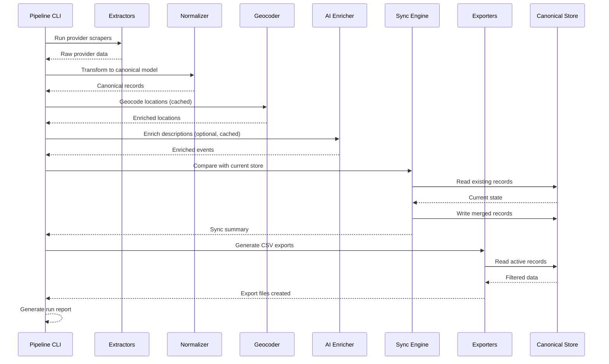

# Design Document: Scraper Pipeline Refactor

## Overview

This design refactors the RostaScrapers repository from a collection of independent scraper scripts into a robust, maintainable data pipeline. The current implementation consists of provider-specific scripts that output flat JSON files with event data. The refactored system will introduce a normalized data model with separate entities for providers, locations, event templates, and event occurrences, along with incremental sync capabilities, geocoding, AI enrichment, and dual CSV exports for events and locations.

The architecture maintains the pragmatic, script-based nature of the current implementation while adding clear separation of concerns through distinct pipeline stages: extraction, normalization, enrichment, sync, and export. The system will support deterministic record IDs, change detection via hashing, soft deletes for lifecycle management, and caching for expensive operations like geocoding and AI enrichment.

## Version 1 Scope

**Must-Have for v1** (core functionality):
- Canonical models (Provider, Location, EventTemplate, EventOccurrence)
- Stable deterministic IDs
- Normalized location extraction
- Persistent JSON store (dict-keyed files)
- Merge/update/remove logic with change detection
- events.csv export
- locations.csv export
- Validation and error handling
- Simple CLI with basic commands

**Nice-to-Have for v1.5** (enhancements):
- Geocoding with Mapbox integration
- AI enrichment with LLM
- providers.csv export
- Archive snapshots
- Property-based testing with Hypothesis
- Dry-run mode
- Parallel scraping

This scoping ensures v1 delivers a clean, working refactor with the core data management capabilities. Enrichment features can be added incrementally once the foundation is solid.

## Architecture

The refactored system follows a linear pipeline architecture with five distinct stages:


Each stage operates on well-defined data structures and can be tested independently. The pipeline is orchestrated by a main CLI that coordinates stage execution and handles error reporting.

### High-Level System Flow



### Directory Structure


```
RostaScrapers/
├── src/
│   ├── extract/
│   │   ├── __init__.py
│   │   ├── base_scraper.py
│   │   ├── pasta_evangelists.py
│   │   ├── comptoir_bakery.py
│   │   └── caravan_coffee.py
│   ├── transform/
│   │   ├── __init__.py
│   │   ├── normalizer.py
│   │   └── id_generator.py
│   ├── enrich/
│   │   ├── __init__.py
│   │   ├── geocoder.py
│   │   ├── ai_enricher.py
│   │   └── prompts.py
│   ├── sync/
│   │   ├── __init__.py
│   │   ├── merge_engine.py
│   │   └── lifecycle.py
│   ├── export/
│   │   ├── __init__.py
│   │   ├── csv_exporter.py
│   │   └── formatters.py
│   ├── models/
│   │   ├── __init__.py
│   │   ├── provider.py
│   │   ├── location.py
│   │   ├── event_template.py
│   │   └── event_occurrence.py
│   ├── storage/
│   │   ├── __init__.py
│   │   ├── store.py
│   │   └── cache.py
│   ├── pipeline/
│   │   ├── __init__.py
│   │   ├── orchestrator.py
│   │   └── validator.py
│   └── config/
│       ├── __init__.py
│       └── settings.py
├── data/
│   ├── raw/
│   ├── current/
│   └── archive/
├── cache/
│   ├── geocoding/
│   └── ai/
├── exports/
├── logs/
├── tests/
│   ├── test_id_generation.py
│   ├── test_merge_logic.py
│   ├── test_lifecycle.py
│   └── test_exports.py
├── config/
│   └── pipeline.yaml
├── requirements.txt
├── README.md
└── run_pipeline.py
```


## Components and Interfaces

### Component 1: Extractors

**Purpose**: Fetch raw data from provider websites and APIs, preserving source-specific logic while emitting standardized intermediate data structures.

**Interface**:
```python
class BaseScraper(ABC):
    """Abstract base class for all provider scrapers."""
    
    @abstractmethod
    def scrape(self) -> RawProviderData:
        """Execute scraping logic and return raw structured data."""
        pass
    
    @property
    @abstractmethod
    def provider_name(self) -> str:
        """Return the provider name."""
        pass
    
    @property
    @abstractmethod
    def provider_metadata(self) -> dict:
        """Return provider metadata (website, contact, etc.)."""
        pass
```

**Responsibilities**:
- Fetch data from provider sources (HTML scraping, API calls)
- Handle provider-specific pagination, authentication, rate limiting
- Parse HTML/JSON into intermediate structured format
- Preserve all source data without normalization
- Return RawProviderData containing: provider info, raw locations, raw events/templates
- Handle errors gracefully with logging

**Key Changes from Current Implementation**:
- Scrapers now return structured data objects instead of writing JSON directly
- Location data is extracted as separate entities, not embedded in every event
- Event-location relationships are preserved where available from source


### Component 2: Normalizer

**Purpose**: Transform provider-specific raw data into canonical data models with deterministic IDs and normalized fields.

**Interface**:
```python
class Normalizer:
    """Transforms raw provider data into canonical models."""
    
    def normalize_provider(self, raw_data: RawProviderData) -> Provider:
        """Create canonical Provider record."""
        pass
    
    def normalize_locations(
        self, 
        raw_data: RawProviderData, 
        provider_id: str
    ) -> list[Location]:
        """Create canonical Location records."""
        pass
    
    def normalize_events(
        self, 
        raw_data: RawProviderData, 
        provider_id: str,
        location_map: dict[str, str]
    ) -> list[EventTemplate | EventOccurrence]:
        """Create canonical Event records with location links."""
        pass
```

**Responsibilities**:
- Generate deterministic IDs using provider slug, normalized addresses, titles
- Normalize text fields (strip HTML, clean whitespace, handle nulls)
- Parse and standardize dates, prices, currencies
- Map raw locations to canonical location IDs
- Link events to locations using source data or heuristics
- Compute source hashes for change detection
- Validate required fields


### Component 3: Geocoder

**Purpose**: Enrich location records with geographic coordinates for map display, with intelligent caching to avoid redundant API calls.

**Interface**:
```python
class Geocoder(ABC):
    """Abstract geocoding interface."""
    
    @abstractmethod
    def geocode(self, address: str) -> GeocodeResult:
        """Geocode an address and return coordinates with metadata."""
        pass

class MapboxGeocoder(Geocoder):
    """Mapbox implementation of geocoding."""
    
    def geocode(self, address: str) -> GeocodeResult:
        """Call Mapbox Geocoding API."""
        pass

class CachedGeocoder:
    """Wrapper that adds caching to any geocoder."""
    
    def __init__(self, geocoder: Geocoder, cache: Cache):
        self.geocoder = geocoder
        self.cache = cache
    
    def geocode_location(self, location: Location) -> Location:
        """Geocode location with cache lookup."""
        pass
```

**Responsibilities**:
- Geocode location addresses using configured provider (Mapbox primary)
- Cache results keyed by normalized address
- Skip geocoding if address unchanged and valid result exists
- Store geocoding metadata: provider, status, precision, timestamp
- Handle API errors and rate limits gracefully
- Support multiple geocoding providers via abstraction


### Component 4: AI Enricher

**Purpose**: Enhance event descriptions and extract structured metadata using LLM, with caching and ROSTA brand tone alignment.

**Interface**:
```python
class AIEnricher:
    """Enriches event data using LLM."""
    
    def __init__(self, llm_client: LLMClient, cache: Cache, config: dict):
        self.llm_client = llm_client
        self.cache = cache
        self.config = config
    
    def enrich_event(self, event: EventTemplate | EventOccurrence) -> EnrichedEvent:
        """Enrich event with AI-generated content and metadata."""
        pass
    
    def _build_prompt(self, event: EventTemplate | EventOccurrence) -> str:
        """Build enrichment prompt with ROSTA tone guidelines."""
        pass
    
    def _parse_response(self, response: str) -> EnrichmentData:
        """Parse structured JSON response from LLM."""
        pass
```

**Responsibilities**:
- Clean raw HTML from descriptions before enrichment
- Generate AI-enhanced descriptions in ROSTA brand tone
- Extract structured metadata: tags, skills, age ranges, audience, duration
- Cache enrichments keyed by source hash + prompt version + model
- Only re-enrich when source content or prompt changes
- Preserve original raw descriptions
- Handle LLM errors and timeouts
- Validate extracted metadata for consistency
- Support optional/disabled enrichment via config

**ROSTA Tone Guidelines**:
- Modern, confident, curated, clean, minimal
- Premium but friendly, lifestyle-oriented
- Short, punchy, clear, plain-English
- Avoid dense corporate phrasing, jargon, overexplaining
- Emotionally immediate, low-friction
- Never invent facts not in source data


### Component 5: Sync Engine

**Purpose**: Merge new scraped data with existing canonical store, implementing incremental updates and lifecycle management.

**Interface**:
```python
class MergeEngine:
    """Handles incremental sync and record lifecycle."""
    
    def merge_records(
        self,
        new_records: list[CanonicalRecord],
        existing_records: list[CanonicalRecord],
        record_type: str
    ) -> MergeResult:
        """Merge new records with existing, detecting changes."""
        pass
    
    def _detect_change(
        self,
        new_record: CanonicalRecord,
        existing_record: CanonicalRecord
    ) -> bool:
        """Compare record hashes to detect changes."""
        pass
    
    def _apply_lifecycle_rules(
        self,
        merged_records: list[CanonicalRecord],
        record_type: str
    ) -> list[CanonicalRecord]:
        """Apply expiration and removal rules."""
        pass
```

**Responsibilities**:
- Load existing records from canonical store
- Match new records to existing by deterministic ID
- Detect changes via source hash comparison
- Insert new records with first_seen_at timestamp
- Update changed records, preserving first_seen_at
- Mark missing future events as removed/inactive
- Mark past events as expired
- Preserve unchanged records exactly
- Soft delete (status field) rather than hard delete
- Update last_seen_at timestamps
- Generate sync summary statistics


### Component 6: Exporters

**Purpose**: Generate CSV files for client import, with separate exports for events and locations optimized for different use cases.

**Interface**:
```python
class CSVExporter:
    """Exports canonical data to CSV files."""
    
    def export_events(
        self,
        events: list[EventTemplate | EventOccurrence],
        output_path: str,
        filters: dict = None
    ) -> ExportResult:
        """Export events to CSV with optional filtering."""
        pass
    
    def export_locations(
        self,
        locations: list[Location],
        events: list[EventTemplate | EventOccurrence],
        output_path: str
    ) -> ExportResult:
        """Export locations with event counts for map display."""
        pass
    
    def export_providers(
        self,
        providers: list[Provider],
        output_path: str
    ) -> ExportResult:
        """Export provider directory."""
        pass
```

**Responsibilities**:
- Read active records from canonical store
- Filter by status (default: active only)
- Format fields for CSV export (flatten nested data, handle nulls)
- Generate events.csv with event details and location references
- Generate locations.csv with geocoded coordinates and event summaries
- Optionally generate providers.csv and event_location_links.csv
- Handle CSV escaping and encoding properly
- Validate export completeness
- Report export statistics


### Component 7: Canonical Store

**Purpose**: Persist normalized records with versioning support, enabling incremental sync and historical tracking.

**Interface**:
```python
class CanonicalStore:
    """Storage interface for canonical data."""
    
    def save_providers(self, providers: list[Provider]) -> None:
        """Save provider records."""
        pass
    
    def save_locations(self, locations: list[Location]) -> None:
        """Save location records."""
        pass
    
    def save_events(self, events: list[EventTemplate | EventOccurrence]) -> None:
        """Save event records."""
        pass
    
    def load_providers(self) -> list[Provider]:
        """Load all provider records."""
        pass
    
    def load_locations(self, filters: dict = None) -> list[Location]:
        """Load location records with optional filtering."""
        pass
    
    def load_events(self, filters: dict = None) -> list[EventTemplate | EventOccurrence]:
        """Load event records with optional filtering."""
        pass
    
    def archive_snapshot(self, timestamp: str) -> None:
        """Archive current state to timestamped backup."""
        pass
```

**Responsibilities**:
- Store canonical records as JSON files in data/current/
- Support filtering by status, provider, date ranges
- Archive previous state before each run
- Provide atomic read/write operations
- Handle concurrent access safely
- Support future migration to SQLite if needed

**File Structure** (v1):
- `data/current/providers.json` - Dict keyed by provider_id
- `data/current/locations.json` - Dict keyed by location_id
- `data/current/event_templates.json` - Dict keyed by event_template_id
- `data/current/event_occurrences.json` - Dict keyed by event_id

This dict-keyed structure enables O(1) lookups during merge and avoids linear scans. Each file is a single JSON object with IDs as keys and records as values.

**Archive Structure** (v1.5):
- `data/archive/{timestamp}/` - Timestamped snapshots of canonical store


### Component 8: Pipeline Orchestrator

**Purpose**: Coordinate pipeline stages, handle errors, and generate comprehensive run reports.

**Interface**:
```python
class PipelineOrchestrator:
    """Orchestrates the complete pipeline execution."""
    
    def run(
        self,
        providers: list[str] = None,
        skip_geocoding: bool = False,
        skip_ai_enrichment: bool = False
    ) -> PipelineReport:
        """Execute full pipeline with optional stage skipping.
        
        Note: dry_run parameter planned for v1.5, not implemented in v1.
        """
        pass
    
    def run_stage(self, stage_name: str, **kwargs) -> StageResult:
        """Execute a single pipeline stage."""
        pass
    
    def generate_report(self, results: dict) -> PipelineReport:
        """Generate comprehensive run report."""
        pass
```

**Responsibilities**:
- Execute pipeline stages in correct order
- Pass data between stages
- Handle stage failures gracefully
- Support selective provider execution
- Allow skipping optional stages (geocoding, AI enrichment)
- Collect metrics from each stage
- Generate run summary report
- Log progress and errors
- Support dry-run mode

**CLI Commands** (v1):
```bash
# Run full pipeline for all providers
python run_pipeline.py run

# Run for specific provider only
python run_pipeline.py run --provider pasta-evangelists

# Skip optional enrichment stages (v1.5)
python run_pipeline.py run --skip-ai
python run_pipeline.py run --skip-geocoding

# Regenerate exports from existing store without scraping
python run_pipeline.py export-only

# Validate canonical store without running pipeline
python run_pipeline.py validate

# Show what would happen without making changes (v1.5, not implemented in v1)
python run_pipeline.py run --dry-run
```


## Data Models

### Hash Policy

**Purpose**: Define exactly which fields contribute to change detection hashes to ensure consistent sync behavior.

**source_hash** (drives sync decisions and cache invalidation):
Includes only fields from the original source data:
- title (from source)
- description (raw from source)
- price (from source)
- booking_url or source_url (from source)
- start_at / end_at (from source, for occurrences)
- location reference (from source)
- image_urls (from source)
- availability fields (capacity, remaining_spaces, availability_status from source)
- Any provider-specific source fields

**record_hash** (tracks all canonical field changes):
Includes all normalized canonical fields after transformation:
- All source_hash fields (normalized)
- Computed fields (slug, formatted_address)
- Enriched fields (description_clean, description_ai, tags, skills, etc.)
- Metadata fields (category, sub_category, audience)
- Geocoding results (latitude, longitude)

**Excludes operational/lifecycle fields**:
- first_seen_at
- last_seen_at
- deleted_at
- status (lifecycle state changes don't trigger content hash change)
- Validation metadata
- Run metadata

**Usage Rules**:
- Sync engine uses source_hash to detect if source data changed
- If source_hash unchanged → preserve record exactly, update last_seen_at only
- If source_hash changed → update record, recompute record_hash
- AI enrichment cache uses source_hash + prompt_version + model as key
- Geocoding cache uses address_hash (subset of source_hash) as key
- Export regeneration triggered by record_hash changes
- **Merge and lifecycle rules applied per provider, not globally** (failed provider scrapes don't affect other providers' records)

**Implementation**:
```python
def compute_source_hash(record: dict, source_fields: list[str]) -> str:
    """Compute hash of source fields only."""
    source_data = {k: record.get(k) for k in source_fields}
    canonical_json = json.dumps(source_data, sort_keys=True)
    return hashlib.sha256(canonical_json.encode()).hexdigest()[:12]

def compute_record_hash(record: dict) -> str:
    """Compute hash of all canonical fields."""
    canonical_json = json.dumps(record, sort_keys=True, default=str)
    return hashlib.sha256(canonical_json.encode()).hexdigest()[:12]
```

## Data Models

### Model 1: Provider

```python
@dataclass
class Provider:
    """Canonical provider/organization record."""
    
    provider_id: str              # Deterministic: slug from provider_name
    provider_name: str            # e.g., "Pasta Evangelists"
    provider_slug: str            # e.g., "pasta-evangelists"
    provider_website: str | None
    provider_contact_email: str | None
    source_name: str              # e.g., "Pasta Evangelists API"
    source_base_url: str          # Base URL for scraping
    
    # Lifecycle fields
    status: str                   # active, inactive
    first_seen_at: datetime
    last_seen_at: datetime
    
    # Metadata
    metadata: dict                # Extensible metadata
```

**Validation Rules**:
- provider_id must be unique and non-empty
- provider_name must be non-empty
- provider_slug must match kebab-case pattern
- status must be one of: active, inactive
- first_seen_at <= last_seen_at

**ID Generation**:
```python
def generate_provider_id(provider_name: str) -> str:
    """Generate deterministic provider ID from name."""
    slug = provider_name.lower().strip()
    slug = re.sub(r'[^a-z0-9]+', '-', slug)
    slug = slug.strip('-')
    return f"provider-{slug}"
```


### Model 2: Location

```python
@dataclass
class Location:
    """Canonical location/venue record."""
    
    location_id: str              # Deterministic: provider_slug + normalized address
    provider_id: str              # Foreign key to Provider
    provider_name: str            # Denormalized for convenience
    
    # Address fields
    location_name: str | None     # Venue name if available
    address_line_1: str | None
    address_line_2: str | None
    city: str | None
    region: str | None
    postcode: str | None
    country: str                  # Default: "UK"
    formatted_address: str        # Full address string for display
    
    # Geocoding fields
    latitude: float | None
    longitude: float | None
    geocode_provider: str | None  # e.g., "mapbox"
    geocode_status: str           # not_geocoded, success, failed, invalid_address
    geocode_precision: str | None # e.g., "rooftop", "street", "city"
    geocoded_at: datetime | None
    
    # Contact fields
    venue_phone: str | None
    venue_email: str | None
    venue_website: str | None
    
    # Lifecycle fields
    status: str                   # active, inactive, removed
    first_seen_at: datetime
    last_seen_at: datetime
    deleted_at: datetime | None
    
    # Hashing for change detection
    address_hash: str             # Hash of normalized address fields
```

**Validation Rules**:
- location_id must be unique and non-empty
- provider_id must reference valid Provider
- formatted_address must be non-empty
- If geocoded successfully: latitude in [-90, 90], longitude in [-180, 180]
- geocode_status must be one of: not_geocoded, success, failed, invalid_address
- status must be one of: active, inactive, removed
- first_seen_at <= last_seen_at

**Status Vocabulary**:
- `active`: Location has active events and is currently in use
- `inactive`: Location has no active events but may return
- `removed`: Location no longer appears in source data (soft delete)

**ID Generation**:
```python
def generate_location_id(provider_slug: str, address: str) -> str:
    """Generate deterministic location ID."""
    normalized = normalize_address(address)
    address_key = hashlib.sha256(normalized.encode()).hexdigest()[:12]
    return f"location-{provider_slug}-{address_key}"

def normalize_address(address: str) -> str:
    """Normalize address for consistent hashing."""
    addr = address.lower().strip()
    addr = re.sub(r'\s+', ' ', addr)
    addr = re.sub(r'[^\w\s]', '', addr)
    return addr
```


### Model 3: EventTemplate

```python
@dataclass
class EventTemplate:
    """Canonical event template/type record (recurring or undated events)."""
    
    event_template_id: str        # Deterministic: provider_slug + source_template_id or title
    provider_id: str              # Foreign key to Provider
    source_template_id: str | None # Provider's internal template ID if available
    
    # Core fields
    title: str
    slug: str                     # URL-friendly version of title
    category: str | None          # e.g., "Cooking", "Coffee", "Baking"
    sub_category: str | None      # e.g., "Pasta Making", "Latte Art"
    
    # Description fields
    description_raw: str | None   # Original source description
    description_clean: str | None # HTML stripped, whitespace normalized
    description_ai: str | None    # AI-enhanced description in ROSTA tone
    summary_short: str | None     # ~50 chars for cards
    summary_medium: str | None    # ~150 chars for listings
    
    # Structured metadata (AI-extracted or source-provided)
    tags: list[str]               # e.g., ["hands-on", "italian", "beginner-friendly"]
    occasion_tags: list[str]      # e.g., ["date-night", "team-building", "family"]
    skills_required: list[str]    # e.g., ["none", "basic-cooking"]
    skills_created: list[str]     # e.g., ["pasta-making", "knife-skills"]
    
    # Audience fields
    age_min: int | None
    age_max: int | None
    audience: str | None          # e.g., "adults", "families", "children"
    family_friendly: bool
    beginner_friendly: bool
    
    # Logistics
    duration_minutes: int | None
    price_from: float | None      # Minimum price
    currency: str                 # Default: "GBP"
    
    # Media
    source_url: str | None        # Link to provider's page
    image_urls: list[str]
    
    # Location scope (for templates without specific location links)
    location_scope: str | None    # "provider-wide", "unknown", or null if location_id is set
    
    # Lifecycle fields
    status: str                   # active, inactive, removed
    first_seen_at: datetime
    last_seen_at: datetime
    deleted_at: datetime | None
    
    # Hashing for change detection
    source_hash: str              # Hash of key source fields
    record_hash: str              # Hash of all canonical fields
```

**Validation Rules**:
- event_template_id must be unique and non-empty
- provider_id must reference valid Provider
- title must be non-empty
- slug must match kebab-case pattern
- If price_from is set, must be >= 0
- If age_min/age_max set, must be > 0 and age_min <= age_max
- status must be one of: active, inactive, removed
- currency must be valid ISO code (default GBP)
- If location_scope is set, it must be one of: "provider-wide", "unknown"

**Status Vocabulary**:
- `active`: Template currently offered by provider
- `inactive`: Template temporarily unavailable but may return
- `removed`: Template no longer appears in source data (soft delete)

**Location Scope Field**:
- Used when template has no specific location_id
- `"provider-wide"`: Template available at all provider locations (confirmed by source)
- `"unknown"`: Location relationship not exposed by source
- `null`: Template has specific location_id set (normal case)
- **location_scope is never used on EventOccurrence records** (occurrences always have specific location or null)

**ID Generation**:
```python
def generate_event_template_id(
    provider_slug: str,
    source_template_id: str | None,
    title: str
) -> str:
    """Generate deterministic event template ID."""
    if source_template_id:
        return f"event-template-{provider_slug}-{source_template_id}"
    
    title_slug = slugify(title)
    return f"event-template-{provider_slug}-{title_slug}"

def slugify(text: str) -> str:
    """Convert text to URL-friendly slug."""
    slug = text.lower().strip()
    slug = re.sub(r'[^a-z0-9]+', '-', slug)
    slug = slug.strip('-')
    return slug[:50]  # Limit length
```


### Model 4: EventOccurrence

```python
@dataclass
class EventOccurrence:
    """Canonical event occurrence record (specific dated sessions)."""
    
    event_id: str                 # Deterministic: template_id + location_id + start_at
    event_template_id: str | None # Foreign key to EventTemplate if applicable
    provider_id: str              # Foreign key to Provider
    location_id: str | None       # Foreign key to Location
    source_event_id: str | None   # Provider's internal event ID if available
    
    # Core fields
    title: str
    start_at: datetime | None     # Event start datetime
    end_at: datetime | None       # Event end datetime
    timezone: str                 # e.g., "Europe/London"
    
    # Booking fields
    booking_url: str | None       # Direct booking link
    price: float | None
    currency: str                 # Default: "GBP"
    capacity: int | None
    remaining_spaces: int | None
    availability_status: str      # available, sold_out, cancelled, past
    
    # Description fields (can override template)
    description_raw: str | None
    description_clean: str | None
    description_ai: str | None
    
    # Metadata (can override template)
    tags: list[str]
    skills_required: list[str]
    skills_created: list[str]
    age_min: int | None
    age_max: int | None
    
    # Lifecycle fields
    status: str                   # active, expired, removed, cancelled
    first_seen_at: datetime
    last_seen_at: datetime
    deleted_at: datetime | None
    
    # Hashing for change detection
    source_hash: str              # Hash of key source fields
    record_hash: str              # Hash of all canonical fields
```

**Validation Rules**:
- event_id must be unique and non-empty
- provider_id must reference valid Provider
- location_id must reference valid Location if set
- title must be non-empty
- If start_at and end_at both set, start_at < end_at
- If price is set, must be >= 0
- availability_status must be one of: available, sold_out, limited, unknown
- status must be one of: active, expired, removed, cancelled
- timezone must be valid IANA timezone

**Status Vocabulary** (lifecycle state):
- `active`: Future event currently bookable
- `expired`: Past event (start_at < now)
- `removed`: Future event no longer in source data (soft delete)
- `cancelled`: Event explicitly cancelled by provider

**Availability Status Vocabulary** (booking state, separate from lifecycle):
- `available`: Spaces available for booking
- `sold_out`: No spaces remaining
- `limited`: Few spaces remaining
- `unknown`: Availability not exposed by source

**ID Generation**:
```python
def generate_event_occurrence_id(
    provider_slug: str,
    source_event_id: str | None,
    title: str,
    location_id: str | None,
    start_at: datetime | None
) -> str:
    """Generate deterministic event occurrence ID."""
    if source_event_id:
        return f"event-{provider_slug}-{source_event_id}"
    
    # Fallback: hash of title + location + datetime
    components = [
        slugify(title),
        location_id or "no-location",
        start_at.isoformat() if start_at else "no-date"
    ]
    composite = "-".join(components)
    hash_suffix = hashlib.sha256(composite.encode()).hexdigest()[:8]
    return f"event-{provider_slug}-{hash_suffix}"
```


## Correctness Properties

*A property is a characteristic or behavior that should hold true across all valid executions of a system—essentially, a formal statement about what the system should do. Properties serve as the bridge between human-readable specifications and machine-verifiable correctness guarantees.*

### Property 1: ID Determinism

For all records of the same type with identical source data, the generated ID must be identical across pipeline runs.

**Validates: Requirements 2.2, 2.6**

### Property 2: Hash Stability

For all records, if source fields are unchanged, the source_hash must remain identical.

**Validates: Requirements 2.7, 3.1**

### Property 3: Merge Idempotence

For all record sets, merging the same new records multiple times with unchanged existing records produces identical results.

**Validates: Requirements 3.2**

### Property 4: Lifecycle Consistency

For all events, if start_at is in the past and status is active, after lifecycle rules are applied, status must be expired.

**Validates: Requirements 3.6, 14.2**

### Property 5: Geocoding Cache Effectiveness

For all locations with unchanged addresses and valid cached geocode results, no API call should be made.

**Validates: Requirements 4.2, 12.3, 12.7**

### Property 6: Export Completeness

For all active records in the canonical store, each record must appear exactly once in the corresponding export file.

**Validates: Requirements 7.8**

### Property 7: Referential Integrity

For all events with a location_id, the location_id must reference an existing location in the store.

**Validates: Requirements 6.5, 13.6**

**Testing Strategy**: Load all events and locations, for each event with location_id, assert location exists.


## Error Handling

### Error Scenario 1: Scraper Failure

**Condition**: A provider scraper raises an exception during data extraction (network timeout, parsing error, API change).

**Response**: 
- Log detailed error with provider name, URL, and stack trace
- Continue pipeline with other providers
- Mark provider as failed in run report
- Do not update canonical store for failed provider (preserve previous data)

**Recovery**: 
- Next run will retry the provider
- Manual intervention may be needed if source structure changed
- Failed provider data remains in store from previous successful run

### Error Scenario 2: Geocoding API Failure

**Condition**: Geocoding API returns error (rate limit, invalid API key, service unavailable).

**Response**:
- Log error with location details
- Set geocode_status to "failed" for affected locations
- Continue processing other locations
- Do not block pipeline execution

**Recovery**:
- Next run will retry failed geocodes
- Locations without coordinates still exported but with null lat/lng
- Cache prevents re-attempting recently failed addresses

### Error Scenario 3: AI Enrichment Failure

**Condition**: LLM API returns error, timeout, or invalid JSON response.

**Response**:
- Log error with event details
- Preserve raw and clean descriptions
- Set AI-enriched fields to null
- Continue processing other events
- Do not block pipeline execution

**Recovery**:
- Next run will retry enrichment if source_hash changed
- Events export with clean descriptions if AI enrichment unavailable
- Cache prevents re-attempting recently failed enrichments

### Error Scenario 4: Invalid Data Model

**Condition**: Normalized record fails validation (missing required field, invalid ID format, constraint violation).

**Response**:
- Log validation error with record details and failed constraints
- Skip invalid record
- Continue processing other records
- Include validation failures in run report

**Recovery**:
- Fix scraper logic to provide required fields
- Invalid records not added to canonical store
- Previous valid version preserved if exists

### Error Scenario 5: Store Corruption

**Condition**: Canonical store JSON file is corrupted or unparseable.

**Response**:
- Log critical error
- Attempt to load from most recent archive
- If archive load fails, start with empty store
- Continue pipeline execution

**Recovery**:
- Archive system provides rollback capability
- Manual inspection of corrupted file may be needed
- Next successful run creates new valid store

### Error Scenario 6: Export Failure

**Condition**: CSV export fails (disk full, permission error, encoding issue).

**Response**:
- Log error with file path and details
- Halt pipeline execution (exports are final output)
- Preserve canonical store (already saved)
- Report failure clearly

**Recovery**:
- Fix underlying issue (disk space, permissions)
- Re-run pipeline with --export-only flag to regenerate exports from store
- No need to re-scrape if store is valid


## Testing Strategy

### Unit Testing Approach (v1 Priority)

**Core Logic Tests** (must-have for v1):
- ID generation functions with various inputs (special characters, unicode, empty strings)
- Hash computation for records with different field combinations
- Address normalization with various formats
- Slug generation from titles
- Date parsing and timezone handling
- Price parsing from various formats

**Merge Logic Tests** (must-have for v1):
- New record insertion
- Existing record update detection via hash
- Unchanged record preservation
- Soft delete for missing records
- Lifecycle state transitions (active → expired, active → removed)
- Timestamp updates (first_seen_at, last_seen_at)

**Validation Tests** (must-have for v1):
- Required field validation
- Field format validation (email, URL, ISO codes)
- Constraint validation (age_min <= age_max, start_at < end_at)
- Referential integrity checks

**Export Tests** (must-have for v1):
- CSV field formatting (nulls, lists, escaping)
- Record type handling (template vs occurrence)
- Semicolon-separated list encoding
- Export completeness (all active records present)

**Provider Normalization Tests** (must-have for v1):
- Test at least one provider scraper with saved HTML/JSON fixtures
- Assert normalized output matches expected canonical format
- Assert location extraction is correct
- Assert event-location relationships are preserved

**Coverage Goals for v1**: 
- 80%+ coverage for core logic modules (transform, sync, models)
- 70%+ coverage for export modules
- 60%+ coverage for extraction modules (harder to test due to external dependencies)


### Property-Based Testing Approach (v1.5)

**Property Test Library**: Hypothesis (Python)

**Property Tests** (nice-to-have for v1.5):

1. **ID Generation Determinism**
   - Generate random provider names and addresses
   - Assert ID generation is deterministic (same input → same output)
   - Assert IDs are valid format (no special chars, proper prefix)

2. **Hash Stability**
   - Generate random records
   - Compute hash, modify non-source fields, recompute hash
   - Assert hashes are identical

3. **Merge Idempotence**
   - Generate two disjoint record sets
   - Assert merge(A, B) ∪ merge(C, B) = merge(A ∪ C, B) when A ∩ C = ∅

4. **Lifecycle Transitions**
   - Generate events with random dates
   - Apply lifecycle rules
   - Assert past events are expired, future removed events are marked removed

5. **Export Roundtrip**
   - Generate random records
   - Export to CSV
   - Parse CSV back
   - Assert key fields preserved (allowing for format conversions)

6. **Address Normalization Equivalence**
   - Generate addresses with random whitespace and punctuation
   - Assert normalized versions are equivalent for matching addresses

**Shrinking Strategy**: Use Hypothesis's automatic shrinking to find minimal failing examples.


### Integration Testing Approach (v1 Priority)

**End-to-End Pipeline Tests** (must-have for v1):
- Run complete pipeline with mock scrapers returning known data
- Assert canonical store contains expected records
- Assert exports contain expected rows
- Assert run report shows correct statistics

**Provider-Specific Tests** (must-have for v1):
- Test at least one provider scraper with saved HTML/JSON fixtures
- Assert normalized output matches expected canonical format
- Assert location extraction is correct
- Assert event-location relationships are preserved

**Store Integration Tests** (must-have for v1):
- Test save and load operations with dict-keyed JSON files
- Test filtering by status, provider, date
- Test concurrent access safety

**Export Integration Tests** (must-have for v1):
- Test CSV generation with various record sets
- Test filtering (active only, all statuses)
- Test field formatting (nulls, lists, nested data)
- Test record_type and record_id handling
- Test CSV parsing by external tools

**Cache Integration Tests** (v1.5):
- Test geocoding cache hit/miss behavior
- Test AI enrichment cache hit/miss behavior
- Assert cache keys are stable
- Assert cache invalidation works when source changes

**Archive Tests** (v1.5):
- Test archive creation
- Test rollback from archive

**Test Data Strategy**:
- Use fixtures for provider responses (saved HTML/JSON)
- Use factories for generating test records
- Use mocks for external APIs (geocoding, LLM)
- Use temporary directories for file operations


## Performance Considerations

### Scraping Performance
- Implement polite delays between requests (0.3-0.6s) to avoid rate limiting
- Use connection pooling for API-based scrapers
- Implement timeout handling (25s default)
- Support parallel scraping of independent providers
- Cache provider responses in data/raw/ for debugging

### Geocoding Performance
- Batch geocoding requests where API supports it
- Implement exponential backoff for rate limit errors
- Cache results indefinitely for unchanged addresses
- Skip geocoding for locations with valid cached results
- Typical performance: ~100 locations/minute with caching, ~10/minute without

### AI Enrichment Performance
- Batch enrichment requests where possible
- Implement request queuing to respect rate limits
- Cache results keyed by source_hash + prompt_version + model
- Skip enrichment for unchanged events
- Typical performance: ~20 events/minute with caching, ~5/minute without
- Consider async/parallel processing for large event sets

### Merge Performance
- Use hash-based change detection (O(1) comparison)
- Index existing records by ID for fast lookup
- Avoid full record comparison when hashes match
- Typical performance: ~1000 records/second

### Export Performance
- Stream records to CSV rather than loading all into memory
- Use efficient CSV writer (csv.DictWriter)
- Typical performance: ~5000 records/second

### Storage Performance
- Use JSON for simplicity and human readability
- Consider SQLite migration if dataset exceeds 10,000 records
- Implement lazy loading for large record sets
- Archive old snapshots to keep current store small

### Memory Considerations
- Process records in batches for large datasets
- Stream file I/O where possible
- Clear caches periodically if memory constrained
- Typical memory usage: ~100MB for 1000 events with enrichment


## Security Considerations

### API Key Management
- Store API keys in environment variables, never in code
- Support .env file for local development
- Document required environment variables in README
- Validate API keys at startup before running pipeline
- Required keys: MAPBOX_API_KEY (for geocoding), OPENAI_API_KEY (for AI enrichment, optional)

### Data Privacy
- Scrape only publicly available data
- Do not store personal information from event attendees
- Sanitize any PII that might appear in descriptions
- Follow robots.txt and terms of service for each provider
- Implement User-Agent headers identifying the scraper

### Input Validation
- Validate all external data before processing
- Sanitize HTML to prevent XSS in descriptions
- Validate URLs before making requests
- Limit string lengths to prevent memory issues
- Validate date ranges to prevent invalid timestamps

### File System Security
- Use safe file paths (no path traversal)
- Validate file permissions before writing
- Use atomic writes for critical files (canonical store)
- Implement file locking for concurrent access
- Sanitize filenames from external data

### Network Security
- Use HTTPS for all external requests
- Validate SSL certificates
- Implement request timeouts
- Use connection pooling safely
- Handle redirects carefully

### Dependency Security
- Pin dependency versions in requirements.txt
- Regularly update dependencies for security patches
- Use virtual environments to isolate dependencies
- Scan dependencies for known vulnerabilities
- Minimize dependency count

### Error Message Security
- Do not expose API keys in error messages or logs
- Sanitize file paths in error messages
- Avoid exposing internal system details
- Log securely (separate sensitive data)


## Dependencies

### Core Dependencies
- **Python 3.10+**: Modern Python with type hints and dataclasses
- **requests**: HTTP client for scraping and API calls
- **beautifulsoup4**: HTML parsing
- **lxml**: Fast XML/HTML parser backend for BeautifulSoup

### New Dependencies

**v1 Core Dependencies**:
- **pydantic**: Data validation and settings management
- **python-dotenv**: Environment variable management
- **click**: CLI framework for pipeline commands
- **pytest**: Testing framework
- **pytest-cov**: Test coverage reporting

**v1.5 Optional Dependencies**:
- **openai**: OpenAI API client for AI enrichment (optional)
- **anthropic**: Anthropic API client as alternative LLM (optional)
- **hypothesis**: Property-based testing
- **httpx**: Async HTTP client for parallel requests (optional)

### External Services

**v1.5 Optional Services**:

- **Mapbox Geocoding API**: Primary geocoding provider
  - Requires API key in MAPBOX_API_KEY environment variable
  - Free tier: 100,000 requests/month
  - Fallback: OpenStreetMap Nominatim (no key required, rate limited)

- **OpenAI API**: AI enrichment (optional)
  - Requires API key in OPENAI_API_KEY environment variable
  - Recommended model: gpt-4o-mini for cost efficiency
  - Alternative: Anthropic Claude via ANTHROPIC_API_KEY

### Development Dependencies
- **black**: Code formatting
- **ruff**: Fast Python linter
- **mypy**: Static type checking
- **pre-commit**: Git hooks for code quality

### Requirements File Structure
```
requirements.txt          # Core dependencies
requirements-dev.txt      # Development dependencies
requirements-optional.txt # Optional enrichment dependencies
```


## Implementation Phases

### Phase 1: Foundation and Data Models (v1)
**Goal**: Establish canonical data models and refactor existing scrapers to emit structured data.

**Tasks**:
- Create directory structure (src/, data/, exports/, tests/)
- Implement canonical data models (Provider, Location, EventTemplate, EventOccurrence)
- Implement ID generation functions with deterministic behavior
- Implement hash computation for change detection (source_hash, record_hash)
- Create BaseScraper abstract class
- Refactor existing scrapers to inherit from BaseScraper and return structured data
- Fix Pasta Evangelists scraper to properly extract location relationships (or keep unlinked if not available)
- Add validation logic for canonical models
- Write unit tests for ID generation and validation

**Deliverables**:
- src/models/ with all canonical models
- src/transform/ with normalizer and ID generator
- src/extract/ with refactored scrapers
- tests/ with ID generation and validation tests


### Phase 2: Storage and Sync (v1)
**Goal**: Implement persistent canonical store and incremental merge logic.

**Tasks**:
- Implement CanonicalStore with dict-keyed JSON file backend
- Implement MergeEngine with hash-based change detection
- Implement lifecycle management (expire past events, mark removed events)
- Create pipeline orchestrator skeleton
- Implement basic CLI with click (run, export-only, validate commands)
- Write unit tests for merge logic and lifecycle rules
- Write integration tests for store operations
- Test end-to-end pipeline with mock data

**Deliverables**:
- src/storage/ with store implementation
- src/sync/ with merge engine and lifecycle logic
- src/pipeline/ with orchestrator
- run_pipeline.py CLI entry point
- tests/ with merge and lifecycle tests
- data/current/ with dict-keyed canonical JSON files (providers.json, locations.json, event_templates.json, event_occurrences.json)


### Phase 3: Exports (v1)
**Goal**: Generate CSV exports for events and locations.

**Tasks**:
- Implement CSVExporter with events and locations export
- Design events.csv schema with record_type and record_id columns
- Design locations.csv schema optimized for map display
- Implement field formatting (flatten lists with semicolons, handle nulls, escape CSV)
- Add event count and event names to location export
- Implement filtering (active only by default)
- Add export validation
- Write unit tests for CSV formatting
- Write integration tests for export completeness
- Test CSV imports in spreadsheet software

**Deliverables**:
- src/export/ with CSV exporter and formatters
- exports/events.csv with event data (templates and occurrences)
- exports/locations.csv with location data for maps
- tests/ with export tests
- Documentation of CSV schemas


### Phase 4: Geocoding (v1.5)
**Goal**: Add geocoding with caching for location coordinates.

**Tasks**:
- Implement Geocoder abstract interface
- Implement MapboxGeocoder with API integration
- Implement CachedGeocoder wrapper
- Implement address normalization for cache keys
- Add geocoding to pipeline orchestrator
- Store geocoding metadata (provider, status, precision, timestamp)
- Handle geocoding errors gracefully
- Implement cache invalidation when address changes
- Write unit tests for geocoder
- Write integration tests for cache behavior
- Update locations.csv export with lat/lng fields

**Deliverables**:
- src/enrich/geocoder.py with geocoding logic
- cache/geocoding/ with cached results
- Updated locations.csv with coordinates
- tests/ with geocoding tests
- Documentation for geocoding setup and API keys


### Phase 5: AI Enrichment (v1.5)
**Goal**: Add optional AI enrichment for descriptions and metadata extraction.

**Tasks**:
- Implement AIEnricher with LLM client integration
- Create prompt templates with ROSTA tone guidelines
- Implement structured JSON output parsing
- Implement enrichment caching keyed by source_hash + prompt_version + model
- Add HTML cleaning before enrichment
- Extract structured metadata (tags, skills, age ranges, audience)
- Add enrichment to pipeline orchestrator (optional stage)
- Handle LLM errors and timeouts
- Validate extracted metadata
- Write unit tests for prompt building and response parsing
- Write integration tests for enrichment caching
- Update events.csv export with AI-enriched fields

**Deliverables**:
- src/enrich/ai_enricher.py with enrichment logic
- src/enrich/prompts.py with prompt templates
- cache/ai/ with cached enrichments
- Updated events.csv with AI-enriched descriptions and metadata
- tests/ with enrichment tests
- Documentation for AI enrichment setup and API keys


### Phase 6: Validation and Reporting (v1)
**Goal**: Add comprehensive validation and run reporting.

**Tasks**:
- Implement validation rules for all models
- Add referential integrity checks
- Implement run report generation with statistics
- Add validation summary to run report
- Implement logging throughout pipeline
- Add progress indicators for long-running stages
- Create validation report format
- Update documentation with validation rules

**Deliverables**:
- src/pipeline/validator.py with validation logic
- Enhanced run report with validation summary
- logs/ with pipeline execution logs
- Updated documentation


### Phase 7: Documentation and Polish (v1)
**Goal**: Complete documentation and final refinements.

**Tasks**:
- Write comprehensive README with setup instructions
- Document environment variables and configuration
- Document CSV schemas and field meanings
- Document how to add new provider scrapers
- Document sync behavior and status values
- Add inline code documentation
- Create example configuration files
- Add troubleshooting guide
- Create migration guide from old flat JSON format
- Add example output files to documentation
- Final code review and cleanup

**Deliverables**:
- Updated README.md with complete documentation
- config/pipeline.yaml.example with documented settings (v1.5)
- .env.example with required environment variables
- Example output files (events.csv, locations.csv)
- Migration notes for existing users


## Pasta Evangelists Specific Fix

### Current Problem
The existing scraper fetches locations and templates from the API but assigns the complete list of all provider locations to every event record. This creates incorrect data where each event appears to be available at all 8 locations simultaneously.

### Root Cause Analysis
The Pasta Evangelists API has two relevant endpoints:
- `/api/v2/event_locations` - Returns all venue locations
- `/api/v2/event_templates` - Returns event templates/types

The current implementation builds `all_locations` list and assigns it to every event's `detailed_location` field, losing the actual event-location relationships.

### Investigation Needed
1. Check if event_templates API response includes location references
2. Check if there's an event_occurrences or event_sessions endpoint
3. Inspect template detail endpoints for session/location data
4. Check if booking URLs contain location identifiers

### Proposed Solution

**Option A: If session data is available**
- Fetch event occurrences/sessions from API
- Extract location_id from each session
- Create EventOccurrence records with proper location_id references
- Link each occurrence to its specific location

**Option B: If only templates available**
- Create EventTemplate records (not occurrences)
- Store location relationships separately using template-location links
- If templates are available at multiple known locations, model the many-to-many relationship
- Document that specific session dates/locations require booking system access

**Template-Location Links** (for Option B scenarios):
For v1, if a template is genuinely available at multiple known locations:
- Add `template_location_links.json` in data/current/
- Structure: dict keyed by `{template_id}_{location_id}`
- Each link record contains: template_id, location_id, first_seen_at, last_seen_at
- During export, flatten links into location_id field or export separately
- This avoids creating fake occurrence rows or incorrect all-location assignments

Alternative for v1 (simpler): Flatten template-to-location relationships only during export and do not persist as a separate first-class entity. Use location_scope="provider-wide" for templates available everywhere.

**Option C: If location data is not exposed**
- Create EventTemplate records without location links
- Set location_id to null
- Add location_scope field: "provider-wide" or "unknown"
- Document limitation in provider metadata
- Do NOT link templates to all provider locations without evidence
- Only export location relationships when actually known
- Note that specific location is selected during booking process

**CRITICAL RULE**: Never link events to all provider locations unless you have real evidence that each template is valid at each location. This creates bad data. Keep templates unlinked if the true mapping is unknown.

### Implementation Changes
```python
# Instead of:
all_locations = [loc["address"] for loc in locations.values()]
for template in templates:
    event["detailed_location"] = all_locations  # Wrong!

# Do:
for template in templates:
    # Extract location references from template data
    location_ids = extract_location_ids(template)
    for location_id in location_ids:
        # Create separate event record for each location
        # OR create template-location link record
```

### Validation
- Assert each event has at most one location_id (for occurrences)
- Assert location_id references exist in locations table
- Assert no event has the full list of all provider locations
- Verify booking URLs are location-specific if possible


## Example Output Schemas

### Canonical Event JSON (EventTemplate)
```json
{
  "event_template_id": "event-template-pasta-evangelists-beginners-class",
  "provider_id": "provider-pasta-evangelists",
  "source_template_id": "1156436138",
  "title": "Beginners Class",
  "slug": "beginners-class",
  "category": "Cooking",
  "sub_category": "Pasta Making",
  "description_raw": "Join us to master the techniques of pasta fatta a mano...",
  "description_clean": "Join us to master the techniques of pasta fatta a mano (pasta made by hand). This Pasta Beginners is specifically designed for the absolute pasta beginner.",
  "description_ai": "Learn authentic Italian pasta-making from scratch. Perfect for beginners—no experience needed.",
  "summary_short": "Hands-on pasta making for beginners",
  "summary_medium": "Master traditional Italian pasta techniques in this beginner-friendly class with expert chefs, unlimited prosecco, and a meal at the end.",
  "tags": ["hands-on", "italian", "beginner-friendly", "prosecco-included"],
  "occasion_tags": ["date-night", "team-building", "gift-experience"],
  "skills_required": [],
  "skills_created": ["pasta-making", "hand-rolling", "italian-cooking"],
  "age_min": 18,
  "age_max": null,
  "audience": "adults",
  "family_friendly": false,
  "beginner_friendly": true,
  "duration_minutes": 120,
  "price_from": 68.0,
  "currency": "GBP",
  "source_url": "https://plan.pastaevangelists.com/events/themes",
  "image_urls": ["https://cdn.shopify.com/s/files/1/1725/5449/files/event-pasta-academy-aldgate-beginners-class-friday-april-18th-2025-20-30-1156436138.png"],
  "status": "active",
  "first_seen_at": "2025-01-15T10:30:00Z",
  "last_seen_at": "2025-01-20T14:22:00Z",
  "deleted_at": null,
  "source_hash": "a3f5e8d9c2b1",
  "record_hash": "f7e2d4c8a9b3"
}
```


### Canonical Location JSON
```json
{
  "location_id": "location-pasta-evangelists-a3f5e8d9c2b1",
  "provider_id": "provider-pasta-evangelists",
  "provider_name": "Pasta Evangelists",
  "location_name": "The Pasta Academy Farringdon",
  "address_line_1": "62-63 Long Lane",
  "address_line_2": null,
  "city": "London",
  "region": "Greater London",
  "postcode": "EC1A 9EJ",
  "country": "UK",
  "formatted_address": "The Pasta Academy, 62-63 Long Lane, London, EC1A 9EJ",
  "latitude": 51.5201,
  "longitude": -0.0982,
  "geocode_provider": "mapbox",
  "geocode_status": "success",
  "geocode_precision": "rooftop",
  "geocoded_at": "2025-01-15T11:00:00Z",
  "venue_phone": null,
  "venue_email": null,
  "venue_website": null,
  "status": "active",
  "first_seen_at": "2025-01-15T10:30:00Z",
  "last_seen_at": "2025-01-20T14:22:00Z",
  "deleted_at": null,
  "address_hash": "d4c8a9b3f7e2"
}
```


### Events CSV Schema
```csv
record_type,record_id,event_template_id,provider_id,provider_name,title,category,sub_category,description_clean,description_ai,summary_short,tags,skills_required,skills_created,age_min,age_max,audience,family_friendly,beginner_friendly,duration_minutes,price,currency,location_id,location_name,formatted_address,booking_url,source_url,image_url,status,first_seen_at,last_seen_at
template,event-template-pasta-evangelists-beginners-class,,provider-pasta-evangelists,Pasta Evangelists,Beginners Class,Cooking,Pasta Making,"Join us to master the techniques of pasta fatta a mano...","Learn authentic Italian pasta-making from scratch. Perfect for beginners—no experience needed.",Hands-on pasta making for beginners,hands-on;italian;beginner-friendly;prosecco-included,,pasta-making;hand-rolling;italian-cooking,18,,adults,false,true,120,68.0,GBP,location-pasta-evangelists-a3f5e8d9c2b1,The Pasta Academy Farringdon,"The Pasta Academy, 62-63 Long Lane, London, EC1A 9EJ",https://plan.pastaevangelists.com/events/themes,https://plan.pastaevangelists.com/events/themes,https://cdn.shopify.com/.../beginners-class.png,active,2025-01-15T10:30:00Z,2025-01-20T14:22:00Z
occurrence,event-comptoir-bakery-abc123,event-template-comptoir-bakery-croissant-class,provider-comptoir-bakery,Comptoir Bakery,Croissant Making Class,Baking,Pastry,"Learn the art of French croissant making...","Master flaky, buttery croissants in this hands-on French baking class.",French croissant baking class,hands-on;french;baking;pastry,,croissant-making;lamination;french-baking,16,,adults,false,true,180,75.0,GBP,location-comptoir-bakery-xyz789,Comptoir Bakery Shoreditch,"123 High Street, London, E1 6JE",https://bookwhen.com/comptoir/e/ev-abc123,https://comptoirbakery.com/classes,https://comptoir.com/.../croissant.jpg,active,2025-01-18T09:00:00Z,2025-01-20T14:22:00Z
```

**Export Rules**:
- `record_type`: "template" or "occurrence" (identifies row type)
- `record_id`: Always contains the real canonical ID for this row (event_template_id for templates, event_id for occurrences)
- `event_template_id`: Only populated for occurrence rows (foreign key to template), empty for template rows
- **In template rows, record_id IS the template ID. event_template_id remains blank because it is reserved as a parent reference field for occurrence rows only.**
- Template rows do NOT pretend to be occurrences
- Each row represents exactly one canonical record

**Field Notes**:
- Lists (tags, skills) are semicolon-separated (standardized across all CSV exports)
- Nulls are represented as empty strings
- Dates in ISO 8601 format
- Boolean values as "true"/"false"
- Multiple images: semicolon-separated if multiple needed


### Locations CSV Schema
```csv
location_id,provider_id,provider_name,location_name,formatted_address,address_line_1,city,region,postcode,country,latitude,longitude,geocode_status,venue_phone,venue_email,venue_website,event_count,active_event_count,event_names,active_event_ids,status,first_seen_at,last_seen_at
location-pasta-evangelists-a3f5e8d9c2b1,provider-pasta-evangelists,Pasta Evangelists,The Pasta Academy Farringdon,"The Pasta Academy, 62-63 Long Lane, London, EC1A 9EJ",62-63 Long Lane,London,Greater London,EC1A 9EJ,UK,51.5201,-0.0982,success,,,https://pastaevangelists.com,15,15,"Beginners Class;Taste of Rome;Taste of Amalfi;Four Cheese Ravioli;...","event-template-pasta-evangelists-beginners-class;event-template-pasta-evangelists-taste-of-rome;...",active,2025-01-15T10:30:00Z,2025-01-20T14:22:00Z
```

**Field Notes**:
- event_count: Total events associated with this location
- active_event_count: Events with status=active
- event_names: Semicolon-separated list of event titles (truncated if too long)
- active_event_ids: Semicolon-separated list of active event IDs for linking
- Optimized for map display with lat/lng and summary information
- Includes provider context for map markers
- Lists are semicolon-separated (standardized across all CSV exports)


## Migration Notes

### From Old Flat JSON to New Canonical Store

**Current State**:
- Flat JSON files at repo root: `pasta_evangelists_experiences.json`, `comptoir_bakery_experiences.json`, `caravan_coffee_school_experiences.json`
- Each file contains array of experience objects with embedded location data
- No persistent state between runs (full overwrite)
- No change tracking or lifecycle management

**New State**:
- Canonical JSON files in `data/current/`: `providers.json`, `locations.json`, `event_templates.json`, `event_occurrences.json`
- Each file is a dict keyed by record ID (not arrays)
- Optional: `template_location_links.json` if many-to-many relationships needed
- Normalized relational structure with foreign keys
- Incremental updates with change detection
- Lifecycle management with soft deletes
- CSV exports in `exports/` directory

**Migration Strategy**:

1. **First Run**: 
   - Old JSON files remain untouched
   - New pipeline creates canonical store from scratch
   - All records marked as new (first_seen_at = run time)
   - Exports generated in new format

2. **Validation**:
   - Compare old JSON record count to new events.csv row count
   - Verify all providers present
   - Verify location extraction worked correctly
   - Check that event-location relationships are reasonable

3. **Cutover**:
   - Archive old JSON files to `data/archive/legacy/`
   - Update any downstream consumers to use new CSV exports
   - Remove old scraper scripts (replaced by new extractors)
   - Remove `run_all_scrapers.py` (replaced by `run_pipeline.py`)

4. **Backward Compatibility**:
   - Keep `scraper_utils.py` for shared utilities
   - Maintain similar scraping logic in new extractors
   - Preserve polite delays and error handling patterns

**Breaking Changes**:
- Output format changed from JSON to CSV
- Location data now separate from event data
- Event records have IDs and lifecycle status
- Some fields renamed for consistency
- Lists now semicolon-separated in CSV instead of JSON arrays

**Data Mapping**:
```
Old Format                    → New Format
experience_name               → title
experience_description        → description_raw / description_clean
experience_provider_name      → provider_name (in Provider record)
detailed_location             → formatted_address (in Location record)
email_contact                 → provider_contact_email (in Provider record)
price                         → price_from (parsed to float)
website                       → booking_url or source_url
images                        → image_urls
```


## Design Decisions and Rationale

### JSON vs SQLite for Canonical Store
**Decision**: Start with JSON files, support SQLite migration later.

**Rationale**:
- JSON is human-readable and easy to inspect/debug
- No additional dependencies or setup required
- Sufficient performance for expected dataset size (<1000 events)
- Easy to version control and diff
- Can migrate to SQLite if dataset grows beyond 10,000 records
- Maintains pragmatic, lightweight approach of current implementation

### EventTemplate vs EventOccurrence Split
**Decision**: Support both models with strict creation rules.

**Rationale**:
- Some providers offer recurring templates without specific dates (Pasta Evangelists)
- Some providers offer specific dated sessions (Comptoir Bakery via Bookwhen)
- Unified interface allows consistent processing
- Exports can include both types
- Allows future expansion to session-level data when available

**CRITICAL IMPLEMENTATION RULE**:
- If the source has a real scheduled datetime → create EventOccurrence
- If the source only has a reusable class/product/theme → create EventTemplate
- NEVER invent occurrence rows from templates without source support
- NEVER duplicate templates into fake per-location dated rows
- NEVER create hybrid records that mix template and occurrence semantics

### Soft Delete vs Hard Delete
**Decision**: Use soft delete with status field and deleted_at timestamp.

**Rationale**:
- Preserves historical data for analysis
- Allows "undelete" if event reappears
- Supports audit trail
- Enables reporting on removed events
- Minimal storage overhead
- Can be purged later if needed

### Cache Key Design
**Decision**: Use content-based hashing for cache keys (address hash, source hash).

**Rationale**:
- Deterministic and stable across runs
- Automatically invalidates when content changes
- No manual cache invalidation needed
- Works across different record IDs
- Prevents unnecessary API calls

### AI Enrichment as Optional Stage
**Decision**: Make AI enrichment optional and skippable via config.

**Rationale**:
- Not all users have LLM API access
- Adds cost and latency
- Core pipeline should work without it
- Allows testing without API keys
- Can be enabled selectively per provider
- Maintains backward compatibility

### Geocoding Provider Abstraction
**Decision**: Abstract geocoding behind interface, support multiple providers.

**Rationale**:
- Mapbox may not be available to all users
- Allows fallback to free services (Nominatim)
- Future-proof for provider changes
- Enables testing with mock geocoder
- Supports different precision/cost tradeoffs

### Deterministic ID Generation
**Decision**: Generate IDs from normalized source data, not random UUIDs.

**Rationale**:
- Enables idempotent pipeline runs
- Allows matching records across runs without database
- Simplifies testing and debugging
- Prevents duplicate records
- Supports distributed/parallel processing
- Makes IDs meaningful and traceable


## Assumptions and Limitations

### Assumptions

1. **Provider Stability**: Provider websites and APIs maintain relatively stable structure between runs
2. **Data Volume**: Total dataset remains under 10,000 events (suitable for JSON storage)
3. **Run Frequency**: Pipeline runs daily or weekly, not real-time
4. **Single User**: No concurrent pipeline execution (file-based locking sufficient)
5. **English Language**: All content is in English (affects AI enrichment prompts)
6. **UK Geography**: All locations are in the UK (affects geocoding and timezone handling)
7. **Public Data**: All scraped data is publicly available and scraping is permitted
8. **API Availability**: External APIs (Mapbox, OpenAI) are available and within rate limits

### Limitations

1. **Pasta Evangelists Sessions**: If session-level location data is not exposed by API, events will be kept as unlinked templates with location_scope="provider-wide" rather than incorrectly linking to all locations
2. **Real-Time Availability**: Remaining spaces and availability status may be stale between runs
3. **Historical Data**: No historical tracking of price changes or description edits (only current state)
4. **Image Storage**: Images are referenced by URL, not downloaded/stored locally
5. **Booking Integration**: No direct booking capability, only links to provider booking pages
6. **Multi-Language**: No support for non-English content or translations
7. **Complex Pricing**: Only simple price_from captured, not complex pricing tiers or dynamic pricing
8. **Capacity Tracking**: Capacity and remaining spaces only available if exposed by provider
9. **Cancellations**: No automatic detection of cancelled events (relies on provider removing them)
10. **Performance**: Geocoding and AI enrichment add significant latency (minutes for large datasets)
11. **Concurrent Access**: File-based store does not support concurrent writes from multiple processes
12. **Schema Evolution**: Changing canonical models requires migration logic for existing data

### Known Issues to Address

1. **Pasta Evangelists Location Mapping**: Current implementation assigns all locations to all events - requires investigation of API to fix
2. **Comptoir Bakery Ticket Packages**: Creates separate event records per ticket type - may want to model as variants instead
3. **Caravan Coffee Eventbrite Dependency**: Relies on Eventbrite page structure - fragile to changes
4. **Price Parsing**: Various formats (£68, £68 pp, £68.00) need consistent normalization
5. **Date Parsing**: Need to handle various date formats and timezone conversions
6. **HTML Cleaning**: Need robust HTML stripping that preserves meaningful structure

